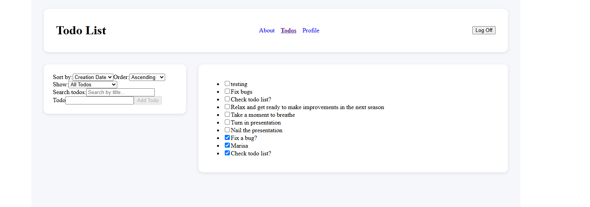
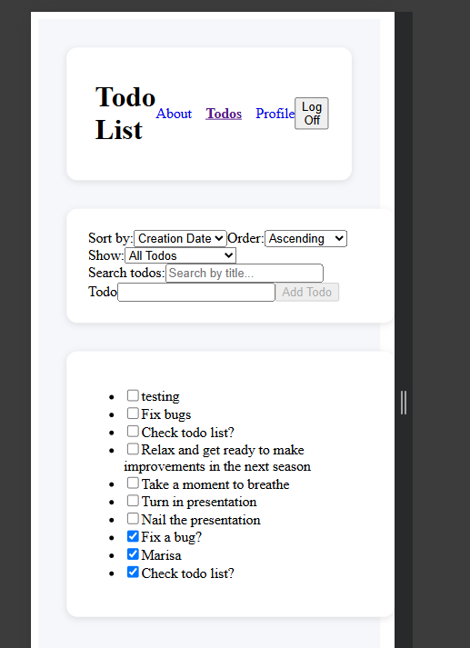

About This Project

Hello there! This is my Todo List application built with React and Vite as part of my Code the Dream journey. The goal of this project was to learn how React works while building something useful that lets users create, edit, complete, sort, and filter their daily tasks.

Along the way I learned how websites can be built with separate pages using React Router and how different components and functions work together to automatically update the page without needing a refresh. I also learned how web applications can fetch data from APIs and display that data as the page renders.

Admittedly, I still have a lot to learn and a lot to understand, so I'm not quite where I want to be yet. However, every project teaches me something new, and my goal is to continue improving until I'm comfortable moving on to more advanced React development.

Features
Add new todos
Edit existing todos
Mark tasks as completed
Filter between All, Active, and Completed tasks
Search for specific todos
Sort todos in different ways
Protected pages that require login
Responsive layout that works on different screen sizes
Technologies Used
React
Vite
JavaScript
React Router
Context API
useReducer
useEffect
useMemo
CSS
Fetch API
Screenshots

Desktop View

Mobile View

Installation

Clone the repository:

gh repo clone MarshadowReaper/My-Todo-List
cd Code The Dream React/My-Todo-List

Install dependencies:

npm install
npm install dompurify

Start the development server:

npm run dev
Available Scripts

Start the project:

npm run dev

Build the project:

npm run build

Preview the production build:

npm run preview
Design Decisions

I wanted the app to feel simple and organized, so I separated the area for creating todos from the area that displays them. My goal was to make it easy for users to focus on adding tasks while still keeping their list easy to read and manage.

I also used React Router for navigation, Context API for authentication, and useReducer to keep my todo state organized as the project became more complex.

Future Improvements

In the near future, I would like to add:

Delete completed todos
Drag-and-drop task ordering
Categories and priorities
Dark mode
Due dates and reminders
User customization options
License

This project is available under the MIT License.

Contact

GitHub: https://github.com/MarshadowReaper

Portfolio: http://127.0.0.1:5500/Boilerplate.html
